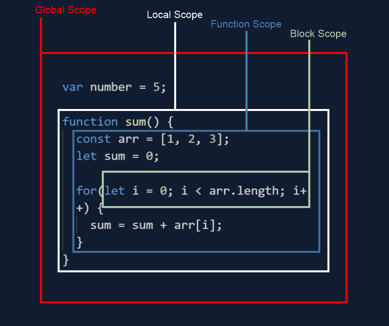

    

# Week 3 - Notes

## Functions in JS

Functions are a **fundamental** part of programming languages. They provide programmers with the ability to execute a piece of code **only if/when** the function in which that code has been written is **called**. Thus, functions implement the concept of **scopes**: the lines of code which a given piece of code has access to.

Functions are **procedures** that have **parameters** (inputs) and **returns** (outputs). When the function is called those parameters receive actual **input values** (the **arguments**). Those arguments are then processed by the fuctions and it returns **one output value**.

### **Declaration:**

 As is the case with values, functions have to be declared before they can be used. Function declaration requires the use of the function keyword, a function name, followed by parenthesis and finally brackets. 

    > function functionName() {
        codeBlock
    }
### **Parametrization:**

Functions can have one or more parameters. Parameters allow previously declared values to be passed within the function in the form of arguments, so its code can access them and run.
    
    > function functionName(parameter1, parameter2) {
        codeBlockThatUsesParameters
    }
### **Return Statement:**

The return statement ends the execution of the function. As such, it must always be written **at the end** of the function. It specifies a value to be returned, such value must be placed **after** the return statement.

    > functionName(parameter) {
        codeBlockThatUsesParameter
    return value
    }
### **Function Call:**

    > functionName(argument)
***

## Scope

Lorem ipsum dolor sit amet, consectetur adipiscing elit, sed do eiusmod tempor incididunt ut labore et dolore magna aliqua. Ut enim ad minim veniam, quis nostrud exercitation ullamco laboris nisi ut aliquip ex ea commodo consequat.

### **Global Scope**
Lorem ipsum dolor sit amet, consectetur adipiscing elit, sed do eiusmod tempor incididunt ut labore et dolore magna aliqua. Ut enim ad minim veniam, quis nostrud exercitation ullamco laboris nisi ut aliquip ex ea commodo consequat. 

### **Local Scope**

+ #### **Function Scope**

+ #### **Block Scope**

***
## Conditional Structures

### **Conditional operator (Ternary):**
The **ternary** operator blablablablabla

    > condition ? expressionIfTrue : expressionIfFalse

### **If Else:**
The **if-else** structure is commonly used.
    > if (condition) {
        statement1
        } else if (condition2) {
        statement2
        } else {
        statement3
    }

### **Nested Ifs:**
Nested if-else statements are a kind of hierarchical conditional structure. Their are **not recomended**, and in fact clean code standards tell us **not to use** them. This is due to the fact that they **difficult** code reading and maintenance, as well as being **more prone to errors**.

    > if (condition1) {
        if (nestedCondition) {
           if (superNestedCondition) {
                value
            } else {another value}
        } else {someOtherValue}
    } else evenAnotherValue

### **Switch Case**
This structure uses the **switch** statement, evaluating its value against the values of **case** clauses. If a match is found, it executes the clause's code until a **break** statement is found.

    >switch (expression) {
        case value1:
            statements
        case value2:
            statements
        case value3:
            statements
    }

***
