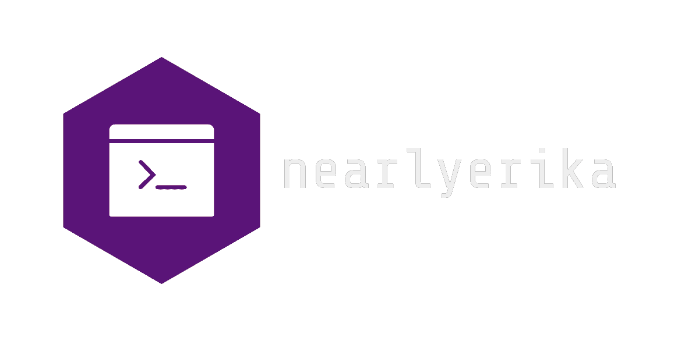

    

# Week 3 - Notes

## Functions in JS

Functions are a **fundamental** part of programming languages. They provide programmers with the ability to execute a piece of code **only if/when** the function in which that code has been written is **called**. Thus, functions implement the concept of **scopes**: the lines of code which a given piece of code has access to.

Functions are **procedures** that have **parameters** (inputs) and **returns** (outputs). When the function is called those parameters receive actual **input values** (the **arguments**). Those arguments are then processed by the fuctions and it returns **one output value**.

### **Declaration:**

 As is the case with values, functions have to be declared before they can be used. Function declaration requires the use of the function keyword, a function name, followed by parenthesis and finally brackets. 

    > function functionName() {
        codeBlock
    }
### **Parametrization:**

Functions can have one or more parameters. Parameters allow previously declared values to be passed within the function in the form of arguments, so its code can access them and run.
    
    > function functionName(parameter1, parameter2) {
        codeBlockThatUsesParameters
    }
### **Return Statement:**

The return statement ends the execution of the function. As such, it must always be written **at the end** of the function. It specifies a value to be returned, such value must be placed **after** the return statement.

    > functionName(parameter) {
        codeBlockThatUsesParameter
    return value
    }
### **Function Call:**

Functions must be **called to run**. Since the code written in a function is only stored in the RAM, its execution depends on a call. Put in another way, its code is **not** scripted. When the function caller calls for the execution of a function, it passes the values as function **arguments**.

    > functionName(argument)
***

## Scope

Scope is a concept used to elaborate the **accessibility of code**. The scope is the **execution context**, the space in which values and expressions can be accessed by other pieces of code. Scope thus helps us understand how a given programming language separates different codeblocks. Learning about scope helps us prevent problematic events such as **variable hoisting**. Javascript provides the following scopes:

### **Global Scope**
Global scope is the **default** execution context **for all code**. A globally declared variable can be acessed **from anywhere** within the program.
### **Local Scope**
Local scopes are **modular** execution contexts. Code written **in scope** is only accessible **from inside** that given scope. There are two kinds of local scopes:

+ #### **Function Scope** – The scope created by a function. Variables declared within the scope of a function can only be acessed by that function.
    

+ #### **Block Scope** – The scope created when a pair of curly brackets is written. This particular scope only scopes let and const variables so one must be aware that if a var is used it can be acessed and modified from outside the block.

***
## Conditional Structures

### **Conditional operator (Ternary):**
The ternary is a special operator that provides a conditional strucure **by itself**. It is the **only** operator in JS that takes **three operands** as parameters: a **condition** and **two expressions**. Only one expression will be executed, depending on the boolen value of the condition. It is an alternative to the if...else statement.

    > condition ? expressionIfTrue : expressionIfFalse

### **If...Else:**
The **if...else** statement is **one of the most commonly used** conditional structures. It works by **specificating a condition** to be verified as either true or false and **executing a specified statement** in the case that said condition is true. It **may** be followed by **one or more else statements**, this clause specifies another condition to be verified and statement to be run.
    
    > if (condition) {
        statement1
        } else if (condition2) {
        statement2
        } else statement3
    

### **Nested Ifs:**
Nested if...else statements are a **hierarchical** conditional structure. They are **not recomended** and, in fact, clean code standards tell us **not to use** them. This is due to the fact that they **difficult** code reading and maintenance, as well as being **more prone to errors**.

    > if (condition1) {
        if (nestedCondition) {
           if (superNestedCondition) {
                statement
            } else {otherStatement}
        } else {someOtherStatement}
    } else evenAnotherStatement

### **Switch Case**
This structure uses the **switch** statement, evaluating its value against the values of **case** clauses. If a match is found, it executes the clause's code until a **break** statement is found.

    >switch (expression) {
        case value1:
            statements
        case value2:
            statements
        case value3:
            statements
    }

***
